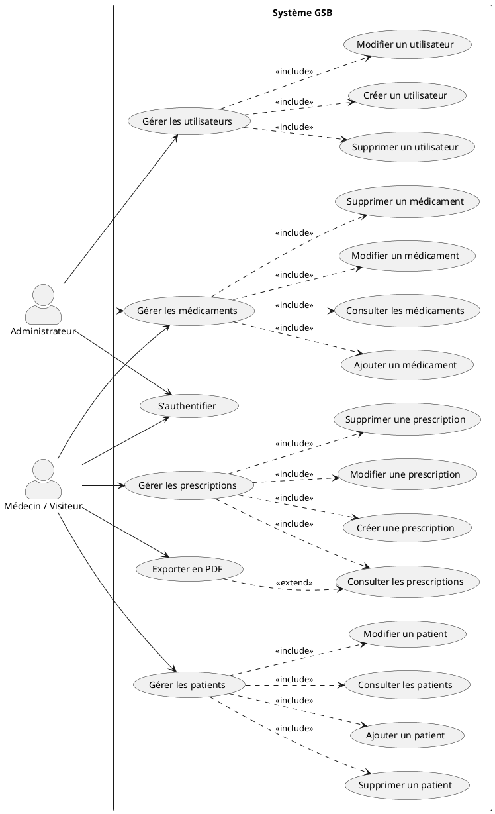
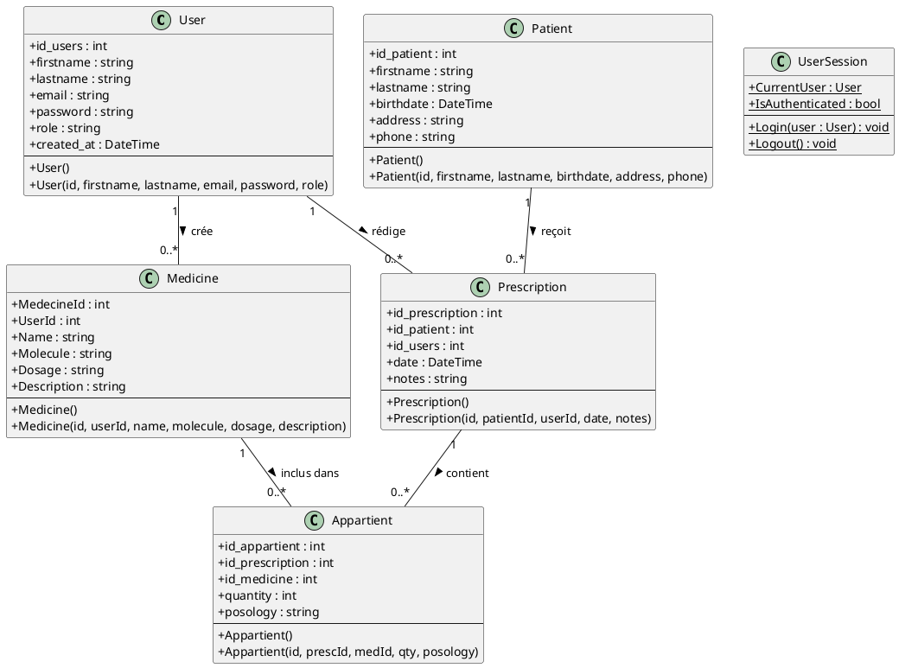
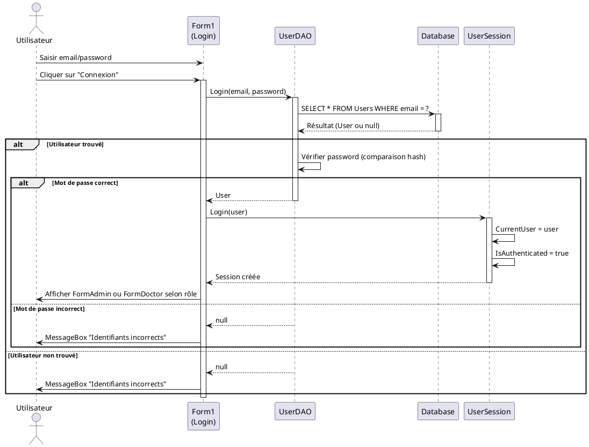
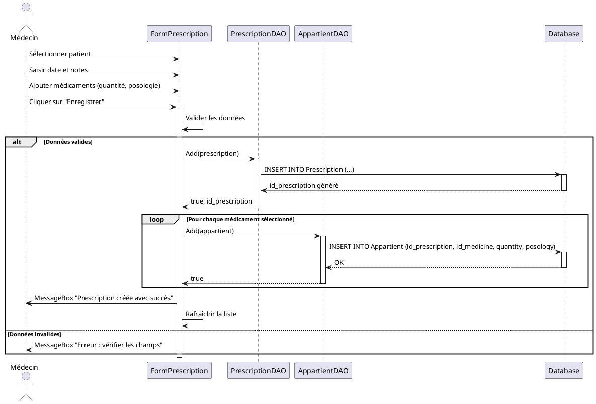
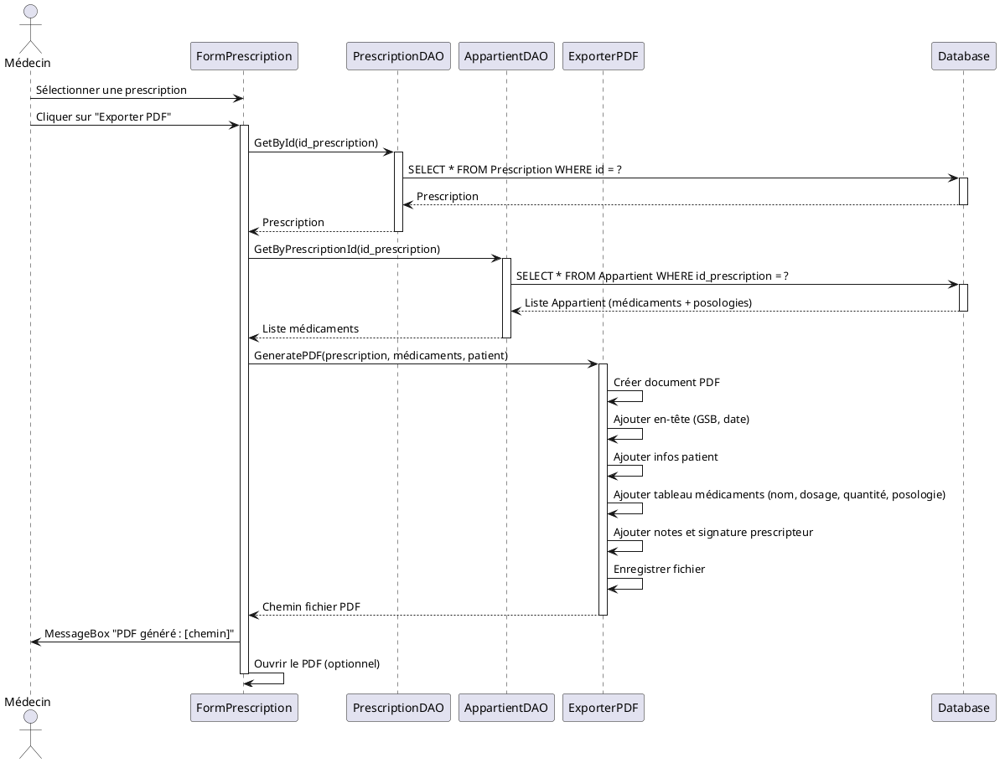
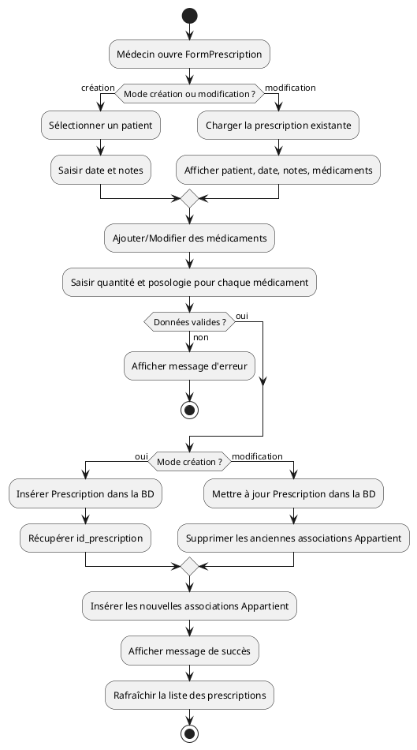

# 2. Diagrammes UML

## 2.1 Diagramme de cas d'utilisation

Le diagramme ci-dessous présente les interactions entre les acteurs (Administrateur, Médecin/Visiteur) et le système GSB.

### Description des cas d'utilisation principaux

| ID | Cas d'utilisation | Acteur(s) | Description |
|----|-------------------|-----------|-------------|
| UC1 | S'authentifier | Admin, Médecin | Connexion avec email et mot de passe. Création d'une session. |
| UC2 | Gérer les utilisateurs | Admin | CRUD des comptes utilisateurs (création, modification, suppression). |
| UC3 | Gérer les patients | Médecin | CRUD des patients (ajout, consultation, modification, suppression). |
| UC4 | Gérer les médicaments | Admin, Médecin | CRUD du catalogue de médicaments. |
| UC5 | Gérer les prescriptions | Médecin | Création, consultation, modification et suppression de prescriptions avec association médicaments. |
| UC6 | Exporter en PDF | Médecin | Génération d'un document PDF d'une prescription sélectionnée. |

---

## 2.2 Diagramme de classes

Le diagramme de classes représente la structure statique de l'application avec les entités métier et leurs relations.

### Description des classes principales

| Classe | Responsabilité |
|--------|----------------|
| **User** | Représente un utilisateur (admin ou médecin). Contient les informations d'authentification et le rôle. |
| **Patient** | Représente un patient avec ses coordonnées. |
| **Medicine** | Représente un médicament du catalogue (nom, molécule, dosage, description). Lié à l'utilisateur créateur. |
| **Prescription** | Représente une prescription rédigée par un utilisateur pour un patient à une date donnée. |
| **Appartient** | Table d'association entre Prescription et Medicine. Contient la quantité et la posologie pour chaque médicament prescrit. |
| **UserSession** | Classe statique pour gérer la session utilisateur en cours (authentification, déconnexion). |

---

## 2.3 Diagramme de séquence : Authentification

Ce diagramme illustre le processus de connexion d'un utilisateur.

---

## 2.4 Diagramme de séquence : Création d'une prescription

Ce diagramme montre le flux complet de création d'une prescription avec association de médicaments.

---

## 2.5 Diagramme de séquence : Export PDF

Ce diagramme illustre le processus d'export d'une prescription au format PDF.

---

## 2.6 Diagramme d'activité : Gestion d'une prescription

Ce diagramme représente le flux de travail complet pour gérer une prescription (création ou modification).

---

## 2.7 Synthèse des diagrammes

| Diagramme | Objectif | Niveau |
|-----------|----------|--------|
| **Cas d'utilisation** | Vue fonctionnelle globale : acteurs et fonctionnalités principales | Analyse |
| **Classes** | Structure statique du système : entités métier et relations | Conception |
| **Séquence (Authentification)** | Flux technique de connexion et gestion de session | Conception détaillée |
| **Séquence (Création prescription)** | Flux de création d'une prescription avec associations | Conception détaillée |
| **Séquence (Export PDF)** | Processus de génération d'un document PDF | Conception détaillée |
| **Activité** | Logique métier de gestion d'une prescription | Analyse/Conception |

Ces diagrammes servent de référence pour l'implémentation du code et la validation des fonctionnalités avec le client/jury.

